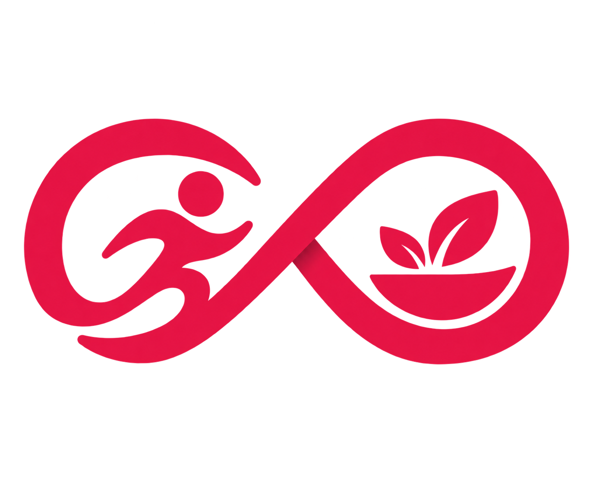

  <picture>
    <source media="(prefers-color-scheme: dark)" srcset="frontend/public/logo/dark_logo.png">
    <source media="(prefers-color-scheme: light)" srcset="frontend/public/logo/light_logo.png">
    
  </picture>

**Nirantar** is a personal fitness and lifestyle tracking platform built around consistency. It helps track workouts, meals, body metrics, and long-term progress while exposing the data through MCP so AI tools like ChatGPT and Claude can provide personalized, data-driven insights and coaching.
